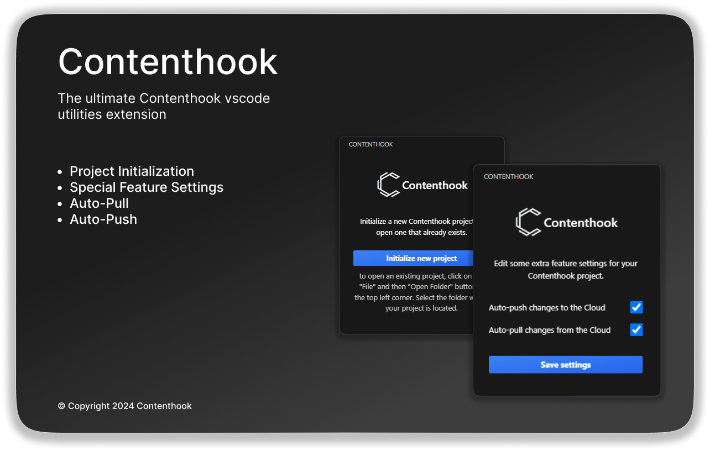

  <picture>
    <source media="(prefers-color-scheme: dark)" srcset="media/product_img.png">
    
  </picture>

## Features

- **Project Initialization**: Initialize a new project contenthook project easily
- **Special Feature Settings**: Configure the special features of contenthook
- **Auto-Pull**: Automatically pull the latest content from the contenthook cloud of your api key and contents
- **Auto-Push**: Automatically push the latest content to the contenthook cloud of your api key and contents

## Requirements

- `vscode` >= 1.90.0

## Known Issues

- Slow and sometimes not properly working theme switch recognition

## Release Notes

### 1.0.0

Initial release of Contenthook for vscode
